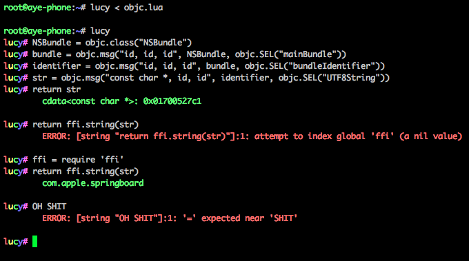

# Lucy



# Building

### Requirements

* Mac OS X
* LuaJIT (`brew install luajit`)
* [LEOS](http://github.com/rweichler/LEOS) (for building)

### The command you need to run

```
git submodule update --init
leos
```


# Shit you can do

## Objective-C stuff

So... I don't have Objective-C support builtin yet because my bindings are shit.

But... if you want to use my shit bindings, then [here you go](https://gist.github.com/rweichler/7821b778467855a9f770abf2ac0a9704).

To use them, just do:

```bash
lucy < objc.lua
```

Then run `lucy` proper, and then you'll have those shitty Obj-C runtime bindings!

## IPC

So I have shitty IPC coded in. Just do this:

```lua
lucy# remote("com.facebook.Messenger")
```

Now you're in Messenger. Do whatever you want there.

To get back to SpringBoard:

```bash
lucy# local
```

Note: piping doesn't work when you're on remote. I'm working on it.
